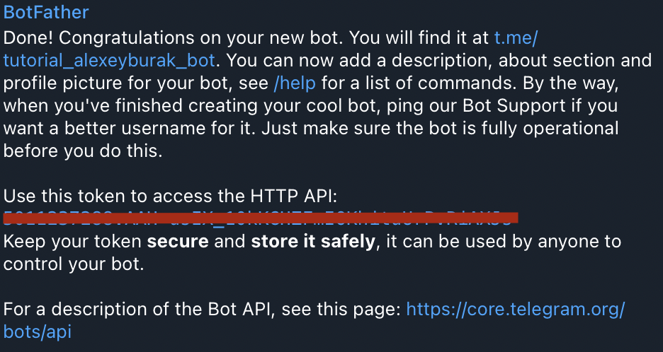

### Introduction

Hello again! In this beginner lesson, you will learn how to create your bot in ***BotFather***, give it a *name* and get an *individual token*.

### Creating a bot

First, you need to go to *telegram* and find ***BotFather*** *(https://t.me/BotFather)*. Then press button `/newbot` and then enter the necessary data for it.

After successfully entering the data, you will be sent a message containing the *name* and *individual token* of your bot.
> We need this data in the future, so you can copy it.

Next, for convenience, I present the commands that you can use in the ***BotFather*** to edit the bot:

* `/setdescription` the description of the bot is set, which is visible when it is launched under the inscription *'What can this bot do?'*
* `/setabouttext` the description of the bot is set, which is visible on the *bot page* and is displayed when your bot is *forwarded*
* `/setuserpic` your bot's *avatar* is being installed
* `/setcommands` setting all the commands of your bot that are *displayed* when *the menu button* is pressed
* `/setjoingroups` is it allowed to *add* your bot to *chats/groups*

The *rest* of the list of commands can be found in the *bot itself*.

This completes the bot setup, in the next lesson we will directly proceed to writing code and implementing the simplest command of sending messages.

[Next lesson](sendMessages.md)
