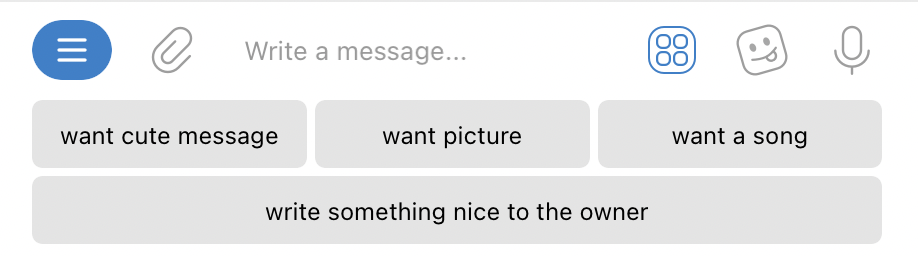
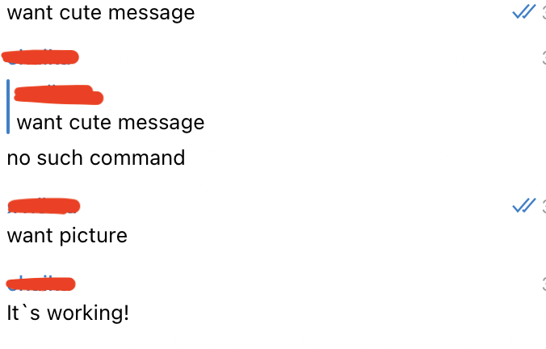

### Introduction

In this lesson we will learn how to ***make buttons*** in the keyboard area

If you didn't open the [previous lesson](sendMessages.md), don't forget to make a `Bot` class with a `token` and `name` of the bot, as well as connect libraries.

### Process

The main function remains unchanged, so just copy it.

```java
public class Main {

    public static void main(String[] args) {
        // Creating a bot
        TelegramBotsApi telegramBotsApi;
        try {
            telegramBotsApi = new TelegramBotsApi(DefaultBotSession.class);
            // Registration of our bot
            // new Handler() is our class, so there is no need to import the proposed library
            telegramBotsApi.registerBot(new HandlerToLessonTwo());
        } catch (TelegramApiException e) {
            e.printStackTrace();
        }

    }
}
```

Then we'll move on to the `HandlerToLessonTwo` class.

> The initial parameters that we did in the last lesson
```java
public class HandlerToLessonTwo  extends TelegramLongPollingBot {

    @Override
    public String getBotUsername() {
        return Bot.USERNAME;
    }

    @Override
    public String getBotToken() {
        return Bot.TOKEN;
    }

    @Override
    public void onUpdateReceived(Update update) {
        
    }
}
```

Next, let's *Override* `onUpdateReceived` method

> To begin with, let's create the buttons themselves using ReplyKeyboardMarkup class
```java
public class HandlerToLessonTwo  extends TelegramLongPollingBot {
    
    @Override
    public void onUpdateReceived(Update update) {
        if (update.hasMessage() && update.getMessage().hasText()) {
            // Initialization Keyboard Markup
            ReplyKeyboardMarkup keyboardMarkup = new ReplyKeyboardMarkup();
            // Create the keyboard (list of keyboard rows)
            List<KeyboardRow> keyboard = new ArrayList<>();
            // Create a keyboard row
            KeyboardRow row = new KeyboardRow();
            // Set button, Row 1 Button 1
            row.add("want cute message");
            // Set button, Row 1 Button 2
            row.add("want picture");
            // Add the first row to the keyboard
            keyboard.add(row);
            // Create another keyboard row
            row = new KeyboardRow();
            // Set button, Row 2 Button 1
            row.add("want a song");
            // Add the second row to the keyboard
            keyboard.add(row);
            // Then you can add the number of buttons you need by analogy
            // Set keyboards to the markup
            keyboardMarkup.setKeyboard(keyboard);
            keyboardMarkup.setResizeKeyboard(true);
        }
    }
}
```

Next, we will add processing of commands entered using the buttons  


> Do not forget that when sending a message, it must have chat id and text
```java
public class HandlerToLessonTwo  extends TelegramLongPollingBot {
    
    @Override
    public void onUpdateReceived(Update update) {
        if (update.hasMessage() && update.getMessage().hasText()){
            // Previous methods
            
            // Initialization received message
            String message_text = update.getMessage().getText();
            // Initialization sendMessage
            SendMessage message = new SendMessage();
            // In advance set chat id to sendMessage
            message.setChatId(update.getMessage().getChatId().toString());

            switch(message_text) {
                case "/start" -> {
                    message.setReplyMarkup(keyboardMarkup);
                    message.setChatId(update.getMessage().getChatId().toString());
                }
                case "want picture" -> message.setText("It`s working!");
                // The following commands are added by analogy
                default -> {
                    message.setReplyToMessageId(update.getMessage().getMessageId());
                    message.setText("no such command");
                }
            }
        }
    }
}
```

After that, the addition and operation of the buttons is completely done, you should have the following code:

> You can add the number of buttons you need by analogy

```java
public class HandlerToLessonTwo  extends TelegramLongPollingBot {

    @Override
    public String getBotUsername() {
        return Bot.USERNAME;
    }

    @Override
    public String getBotToken() {
        return Bot.TOKEN;
    }

    @Override
    public void onUpdateReceived(Update update) {
        if (update.hasMessage() && update.getMessage().hasText()){
            // Initialization Keyboard Markup
            ReplyKeyboardMarkup keyboardMarkup = new ReplyKeyboardMarkup();
            // Create the keyboard (list of keyboard rows)
            List<KeyboardRow> keyboard = new ArrayList<>();
            // Create a keyboard row
            KeyboardRow row = new KeyboardRow();
            // Set button, Row 1 Button 1
            row.add("want cute message");
            // Set button, Row 1 Button 2
            row.add("want picture");
            // Add the first row to the keyboard
            keyboard.add(row);
            // Create another keyboard row
            row = new KeyboardRow();
            // Set button, Row 2 Button 1
            row.add("want a song");
            // Add the second row to the keyboard
            keyboard.add(row);
            // Set keyboard to the markup
            keyboardMarkup.setKeyboard(keyboard);
            keyboardMarkup.setResizeKeyboard(true);
            // Initialization received message
            String message_text = update.getMessage().getText();
            // Initialization sendMessage
            SendMessage message = new SendMessage();
            // In advance set chat id to sendMessage
            message.setChatId(update.getMessage().getChatId().toString());

            switch(message_text) {
                case "/start" -> {
                    message.setReplyMarkup(keyboardMarkup);
                    message.setChatId(update.getMessage().getChatId().toString());
                }
                case "want picture" -> message.setText("It`s working!");
                // The following commands are added by analogy
                default -> {
                    message.setReplyToMessageId(update.getMessage().getMessageId());
                    message.setText("no such command");
                }
            }
            try {
                execute(message); // Sending message
            } catch (TelegramApiException e) {
                e.printStackTrace();
            }
        }
    }
}
```

The pictures show the result of executing this code:

> Buttons instead of a keyboard



> Sending a command with the help of buttons 




Back to [Lesson 1](sendMessages.md) of sending messages to user  
Go to [Lesson 3](sendPhoto.md) of sending photos to user from local directory